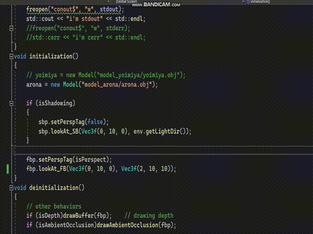

# my Software Renderer

- About

  Now I'm spending some time building a soft-renderer. It won't be so noble though, but it's meaningful to me.  I'm try to build it by C++ from the scratch, using as few libraries as possible. Definitely APIs of some specifications like OpenGL would NOT be used in this project.

- Reference

  I refer the known soft-renderer tutorials, [tinyrenderer](https://github.com/ssloy/tinyrenderer/wiki). However, my codes are quite different from the tutorials contents. I code mainly with the help of the [tigerbook](https://www.amazon.com/Fundamentals-Computer-Graphics-Steve-Marschner/dp/0367505037). After mastering the knowledge in the book, I try to coding myself. It's pretty funny.

- Libraries

  As the original tutorials states, the external libraries included in this project is only TGAimage. Of course, some basic libraries are also included, such as Geometry.

- Functions already finished

  - render a raw model
  - orthogonal/perspective projection
  - hidden face removal (z-buffer)

  - Gouraud shading

  - Phong Shading
  - self-shadowing (hard)
  - output depth map
  - clipping
  - texturing

- Functions expected

  - anti-aliasing
  - soft shadowing
  - more and more smart shaders
  - dynamic camera
  - ......

- Simply have a look

  Because it's rendered totally by CPU, it spends some time. I'll speedup the rendering process as future work.

  

- Others

  If you want to have a check on the renderer code, please open mygl.h and main.cpp files. These 2 are the main codes.

- Copyright

  Models copyright reserves to Yostar Inc and Mihoyo Inc.

  

  

  

  

   